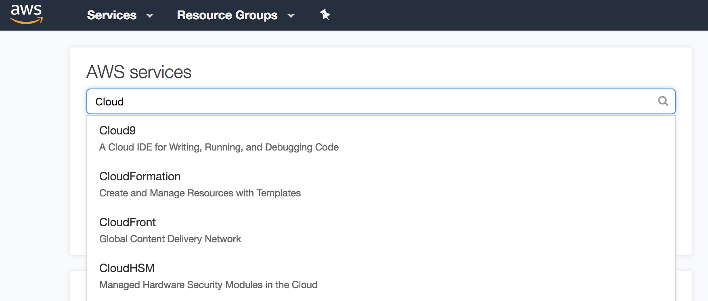
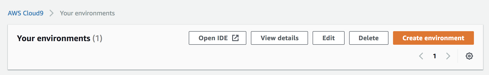
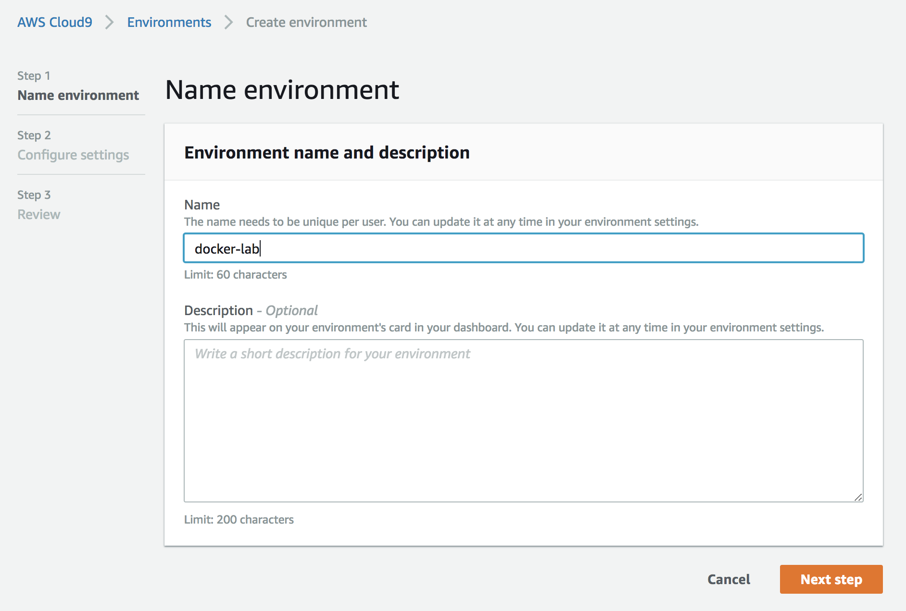
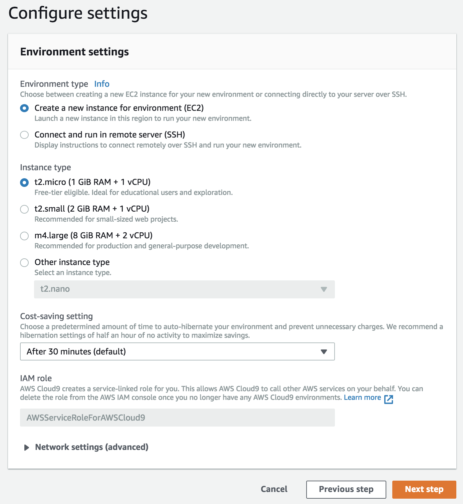
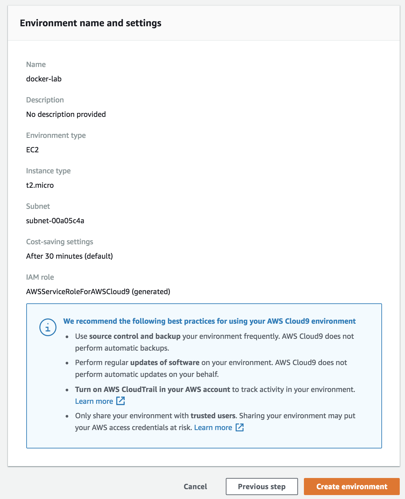
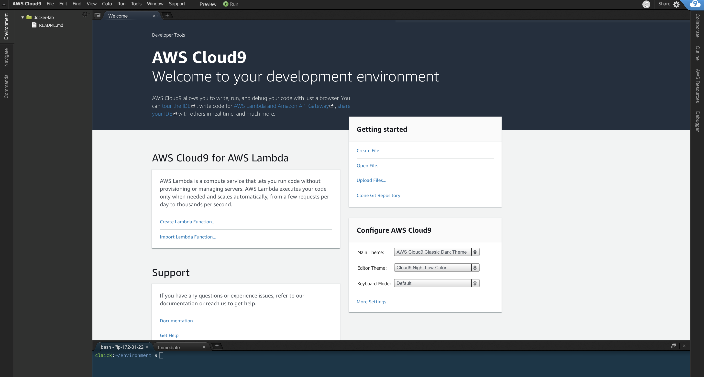

# Preparando Cloud9

## Passo a Passo

Acesse sua conta AWS e após na barra de pesquisa digite "Cloud9" e clique na primeira opção:

Clique em "Create environment"

Escolha um nome e uma descrição

Escolha o tipo "t2.micro" e clique em "Next step"

Verifique as configurações e clique em "Create environment"

Aguarde a IDE do Cloud9 abrir

Divirta-se!