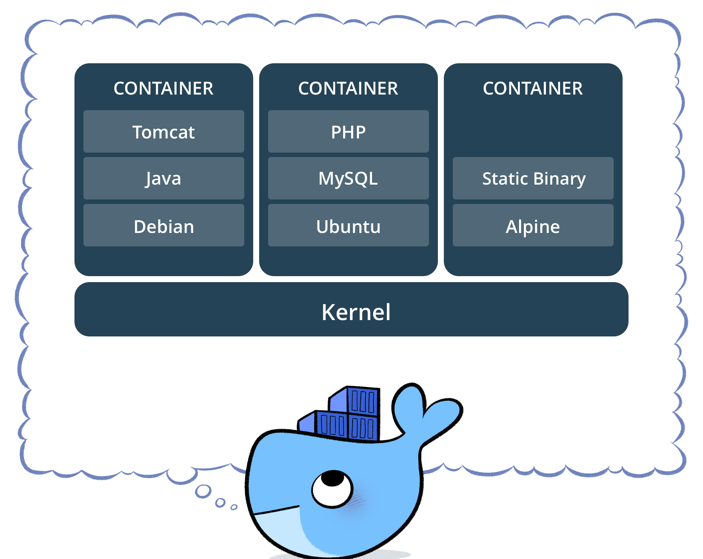

# Docker: Overview

## O que é Docker?

Docker é uma plataforma que utiliza containers para "empacotar" softwares em pequenas unidades padronizadas desde o desenvolvimento, entrega e implantação.

## O que é um Container? E como funciona?

Um container é um ambiente isolado dos demais, para conseguir esse isolamento de recursos o kernel utiliza algumas coisas, as principais são:

* filesystems - namespaces (MNT)
* processos - namespaces (PID)
* network - namespcaes (NET)
* memória - cgroups
* cpu - cgroups
* IO - cgroups

<p align="center">
    
</p>

## O que é uma imagem?

Images Docker são compostas por sistemas de arquivos de camadas que ficam uma sobre as outras. Ela é a nossa base para construção de uma aplicação, ela pode ser desde a base do CentOS como também um CentOS com Apache, PHP e MySQL.

<p align="center">
    
</p>

## Componentes

Para utlizarmos o Docker precisamos entender qual o papel de alguns componentes. Os componentes são:

* docker-cli: É o cliente do docker que interpreta os comandos digitados pelo usuário e chama a API do Host Docker.
* Host Docker: É o servidor/máquina que rodará o Docker daemon e hospedará os containers.
* Docker Daemon: Responsável por receber os comandos enviados pela docker-cli e passar as instruções para o Kernel.
* Registry: Local para armazenar e versionar as imagens das aplicações.

<p align="center">
    
</p>

## Máquinas Virtuais vs Containers

As máquinas virtuais são uma abstração de um hardware físico tornando um servidor em muitos outros. O Hypervisor permite rodar diversos servidores virtuais em uma unica máquina. Cada máquina virtual será um servidor completo tendo seu próprio sistemas de aruiqvos e hardwares virtuais (CPU, memória, redes e etc.).

<p align="center">
    
</p>

Os containers são uma abstração da camada de aplicação tendo os códigos e dependências juntos. Vários containers podem rodar na mesma máquina e compartilhar o Sistema Operacional e kernel com os demais containers, cada processo irá rodar isoladamente.

<p align="center">
    
</p>

## Benefícios

* Portabilidade: Você pode rodar o seu container em qualquer lugar que possua Docker instalado que terá o mesmo comportamento, do ambiente de Dev até Produção.

* Rollback: Após um problema ser identificado durante o deploy, ao rodar versões anteriores de imagens a recuperação será muito mais rápida e eficiente.

* Container Registry: Um local para centralizar todas as imagens, podendo ser público ou privado e mantendo histórico de versões das imagens.

* Runtime: Pode executar um ou milhares de contêineres em poucos segundos.

* Isolamento: Todos os containers em execução seram isolados dos demais processos e sistemas de arquivo do host e entre eles.

Obs: Caso queira se aprofundar em Docker [clique aqui](https://www.docker.com/).

## Lab 1

Nesse primeiro laboratório iremos ver alguns comandos do Docker, como subir seu primeiro container e criar sua primeira imagem por exemplo, em algums exemplos iremos utilizar um nome de container ou ID que foi utilizado durante a criação desse conteúdo lemnre-se que no seu caso pode ser nomes e IDs diferentes.

### Hello World!

Como todo processo de aprendizado iremos começar pelo bom e famoso "Hello World!", mas antes disso vamos verificar algumas informações do nosso host docker.

O comando abaixo irá nos mostrar qual a versão instalada no host:
```bash
docker --version
```

Para termos mais informações detalhadas podemos utilizar:
```bash
docker info
```

Agora que já verificamos várias informações sobre nosso host, iremos executar nosso primeiro container:
```bash
docker run hello-world
```

O comando `docker run` executa o container que irá utilizar uma imagem, nesse exemplo foi a `hello-world`. Após executar esse comando o Docker verifica se a imagem solicitada já existe localmente, caso não encontre a imagem ele irá buscar remotamente no registry https://hub.docker.com/, a seguinte mensagem é um exmplo de ele realizar o download da imagem:

```bash
Unable to find image 'hello-world:latest' locally
latest: Pulling from library/hello-world
9bb5a5d4561a: Pull complete
Digest: sha256:f5233545e43561214ca4891fd1157e1c3c563316ed8e237750d59bde73361e77
Status: Downloaded newer image for hello-world:latest
```

Essa imagem é um exemplo e traz uma mensagem de como utilizar o Docker e também o passo a passo que ele fez para conseguir executar o container.

Se executarmos novamente o mesmo comando a mensagem que nos avisa que a imagem não foi encontrada não será apresentada novamente:

```bash
docker run hello-world
```

### Comandos

O Docker assim como qualquer ferramenta possui diversos comandos, execute o seguinte o comando:
```bash
docker --help
```

Existe diversos comandos mas pode ficar tranquilo que veremos os mais utilizados. O primeiro comando que iremos abordar será o `docker container`, com ele iremos gerenciar nossos containers. Execute o comando a seguir:

```bash
docker container
```

Como não passamos nenhum parâmetros ele irá trazer todas as opções possíveis. No momento iremos focar apenas em:

* run
* exec
* inspect
* kill
* logs
* rm
* stop

#### Run

O comando `run` serve para executarmo um container, anteriormente nós executamos o `hello-world`. Agora iremos executar outro container o [Nginx](https://www.nginx.com/), o `nginx` é um servidor web assim como o famoso `apache`. Para executar digite:

```bash
docker container run nginx
```

Com esse comando nós executamos um container rodando `nginx`, porém para termos acesso a esse container, ou seja, acessar o nosso servidor web precisamos informar o docker que queremos expor a porta 80 do nosso host e podermos acessar o container que também esta rodando na porta 80, para sairmos do container anterior execute `Ctrl+c`. Para resolver esse problema iremos utilizar o comando `-p`.

```bash
docker container run -p 80:80 nginx
```

Agora informarmos o Docker para quando uma requisição chegar na porta 80 do host para que ele repasse para o container também na porta 80. Para testar acesse o IP de sua máquina ou servidor via `Browser`. Vejamos outro exemplo:

Obs: Execute `Ctrl+c` novamente para executarmos outro container!

```bash
docker container run -p 80 -d nginx
``` 

Passando apenas `-p 80` o Docker irá utilizar uma porta alta e aleatória do host e toda requisição que chegar nessa porta irá passar para a porta `80`. Antes de descobrirmos qual foi a porta, utilizamos `-d` para que não ficassemos "presos" dentro da execução do container, ou seja, rodar esse container como `daemon`. Agora sim para descobrirmos a porta, digite:

```bash
docker container ls
```

O `ls` lista todos os container em execução e caso queira ver todos os container (executando, parados e etc) utilize no final o `-a` de "all". Apoós digitar você deve ter visto algo como isso:

```bash
955bf03e730d        nginx               "nginx -g 'daemon of…"   About a minute ago   Up About a minute   0.0.0.0:32772->80/tcp   vibrant_meitner
```

Nesse caso a porta aleatória foi a 32772, para testarmos digite:

Obs: Altere a porta para a porta que o seu host está utilizando.

```bash
curl http://localhost:32772
```

Deve ter retornado algo ocmo isso:

```html
<!DOCTYPE html>
<html>
<head>
<title>Welcome to nginx!</title>
<style>
    body {
        width: 35em;
        margin: 0 auto;
        font-family: Tahoma, Verdana, Arial, sans-serif;
    }
</style>
</head>
<body>
<h1>Welcome to nginx!</h1>
<p>If you see this page, the nginx web server is successfully installed and
working. Further configuration is required.</p>

<p>For online documentation and support please refer to
<a href="http://nginx.org/">nginx.org</a>.<br/>
Commercial support is available at
<a href="http://nginx.com/">nginx.com</a>.</p>

<p><em>Thank you for using nginx.</em></p>
</body>
</html>
```

Existem diversos outros parâmetros que pode ser utilzado com o run, porém não vamos entrar a fundo. Caso queira saber mais [accesse aqui](https://docs.docker.com/engine/reference/commandline/container_run/)

#### Exec

Aproveitando o nosso container que foi executado anteriormente, vamos testar o comando `exec`, o exec é o comando que enviará instruções para serem executadas dentro do container. Para executar um comando dentro de um container precisamos primeiro saber o nome ou ID do container, digite:

```bash
docker container ls
```

A saída será algo parecido com:

```bash
3a4ca9c699a3        nginx               "nginx -g 'daemon of…"   2 seconds ago       Up 2 seconds        0.0.0.0:80->80/tcp   gifted_khorana
```

O ID nesse caso é `3a4ca9c699a3` e o nome do container é `gifted_khorana`, para executar um comando dentro do container execute:

```bash
docker container exec 3a4ca9c699a3 ls
```
ou

```bash
docker container exec gifted_khorana ls
```

Esse comando retornará:

```bash
bin   dev  home  lib64  mnt  proc  run   srv  tmp  var
boot  etc  lib   media  opt  root  sbin  sys  usr
```

Ele listou as pastas dentro do container, agora execute:

```bash
docker container exec -it gifted_khorana bash
```

Ele mostrará o bash de dentro do container:

```bash
root@3a4ca9c699a3:/#
```

Agora executamos o comando `bash` (caso não conheça [clique aqui](https://www.gnu.org/software/bash/)) o bash precisa de interação e para isso utilizamos o `-i` que permite ter interação com o container, já o `-t` é responsável de alocar um `tty` (para saber mais [clique aqui](https://en.wikipedia.org/wiki/Teleprinter)).

Obs: Caso queira sair dessa sessão digite:

```bash
exit
```

Para aprender outros parâmetros [clique aqui](https://docs.docker.com/engine/reference/commandline/container_exec/).

#### Inspect

O container que estará rodando assim como qualquer recurso/servidor/aplicação tem diversas informações, para coletarmos informações dos containers utilizaremos o comando `inspect`, digite:

```bash
ocker container inspect gifted_khorana
```

Esse comando retornará um [json](https://en.wikipedia.org/wiki/JSON) com diversas informações, por exemplo ID, data de criação, Argumentos, Estado e etc:

```json
{
    "Id": "3a4ca9c699a32a74234f57a38b2000cc5be6895899762b0dcf65321aa75f1f5e",
    "Created": "2018-04-23T17:31:40.257730595Z",
    "Path": "nginx",
    "Args": [
        "-g",
        "daemon off;"
    ],
    "State": {
    "Status": "running",
    "Running": true,
    "Paused": false,
    "Restarting": false,
    "OOMKilled": false,
    "Dead": false,
    "Pid": 4062,
    "ExitCode": 0,
    "Error": "",
    "StartedAt": "2018-04-23T17:31:40.506671006Z",
    "FinishedAt": "0001-01-01T00:00:00Z"
}
```

#### Stats

Após os containers rodando pode surgir a necessidade de saber qual é a utilização de recursos que os containers estão utilizando do host, para isso iremos utilizaro `stats`, digite:

```bash
docker stats
```

A saída será algo como:

```bash
3a4ca9c699a3        gifted_khorana      0.00%               2.344MiB / 993.2MiB   0.24%               6.86kB / 6.56kB     1.59MB / 0B         0
```

Esse comando traz informações de utilização de CPU, Memória, Rede e Disco. O stats é uma monitoria contínua e para sair dessa tela só digitar `Ctrl+c`.

Saiba mais sobre esse comando [aqui](https://docs.docker.com/engine/reference/commandline/container_stats/).

#### Logs

Outra comando importante para realizar troubleshooting é o `logs`, ele nos ajudará a visualizar os logs de dentro do container. Para conseguir visualizar os logs do nginx que está rodando execute:

```bash
docker container logs gifted_khorana
```

Para ver outros parâmetros [clique aqui](https://docs.docker.com/engine/reference/commandline/container_logs/).

#### Kill & Stop

Para parar/matar um container existem dois comandos o `stop` que realiza um desligamento mais "amigável" enviando um [SIGTERM](https://en.wikipedia.org/wiki/Signal_(IPC)#SIGTERM) e depois de um tempo envia um [SIGKILL](https://en.wikipedia.org/wiki/Signal_(IPC)#SIGKILL), já o `kill` envia um `SIGKILL` ou algum outro sinal específico. Exemplo:

```bash
docker container stop gifted_khorana
```

ou 

```bash
docker container kill gifted_khorana
```

Agora para verificar o container parado execute o comando:

```bash
docker container ls -a
```

O status será algo como:

```bash
Exited (0) About a minute ago
```

Caso queira saber mais sobre os dois clique em [stop](https://docs.docker.com/engine/reference/commandline/container_stop/) ou [kill](https://docs.docker.com/engine/reference/commandline/container_kill/).

#### Rm

O container que paramos no comando anterior ainda continua em nosso host, para vamos utilizar o comando `rm`, com ele apagamos os containers. Execute o seguinte comando:

```bash
docker container rm gifted_khorana
```
