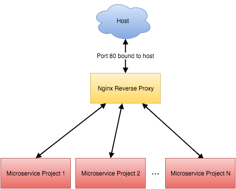

# Docker Compose

## O que é docker-compose?

O `docker-compose` é uma ferramenta para definir e rodar multiplos containers isoladamente em um mesmo host. Com docker-compose você utiliza arquivos [YAML](http://yaml.org/) para configurar os serviços de sua aplicação. Por exemplo com apenas um comando você cria e inicia containers. Para aprender mais sobre as fincionalidades do docker-compose [clique aqui](https://docs.docker.com/compose/overview/#features).

Para utilizar o docker-compose é necessário basicamente 3 passos:

1. Definir suas aplicações com ou sem `Dockerfiles`;
2. Definir os serviços da sua aplicação em seu arquivo `docker-compose.yml`;
3. Executar o comando `docker-compose up`;

Um exemplo de docker-compose.yml:

```YAML
version: '3'
services:
  web:
    build: .
    ports:
    - "5000:5000"
    volumes:
    - .:/code
    - logvolume01:/var/log
    links:
    - redis
  redis:
    image: redis
volumes:
  logvolume01: {}
```

Caso queira aprender mais sobre o docker-compose.yml [clique aqui](https://docs.docker.com/compose/compose-file/).

## Docker-compose na prática

Para entender melhor a utilização do `docker-compose` na raíz desse projeto existe uma pasta chamada app, essa aplicação é feita em python e bem simples. Acesse a pasta `app`:

```bash
cd app
```

Dentro dela você encontrará a aplicação em Python que é uma API que retorna o hostname e um status OK, existem também o Dockerfile para criar a imagem da nossa aplicação e o principal dessa sessão o docker-compose.yml que é responsável por subir a aplicação e um Nginx para servidr de [proxy reverso](https://pt.wikipedia.org/wiki/Proxy_reverso) para nossos containers. Veja o diagrama:

<p align="center">
    
</p>

Para dar uma olhada nos arquivos execute os comandos a baixo:

```bash
cat api.py
cat Dockerfile
```

Já o arquivo docker-compose.yml iremos ver parte por parte.

```YAML
version: '3'

services:
  app:
    build:
      context: .
    command: ["--bind", "0.0.0.0:8000", "wsgi"]
    entrypoint: ["gunicorn"]
    ports:
      - 8000
    networks:
      - network-teste
```

Nesse primeiro bloco de código estamos indicando que iremos utilizar a versão `3` do docker-compose (para saber de outras versões [clique aqui](https://docs.docker.com/compose/compose-file/compose-versioning/#compatibility-matrix)), o `services` indica que a partir desse ponto iniciaremos uma série de ações para criarmos os nossos serviços que são constituídos de um ou mais containers. O nosso primeiro serviço será o `app` e dentro dessa estrutura teremos:

* **build**: indica que esse serviço não utilizará uma imagem como base e faremos um build dele seguindo um Dockerfile;
  * **context**: local onde se encontra os arquivos da aplicação e o Dockerfile;
* **command**: assim como no Dockerfile o command está passando os argumentos para o entrypoint;
* **entrypoint**: comando executado quando o container for iniciado;
* **ports**: portas que vamos expor para o host físico;
* **networks**: rede que o serviço irá utilizar para se comunicar com o host, outros container e a internet caso necessite;

```YAML
web:
  image: nginx
  volumes:
    - ./mysite.template:/etc/nginx/conf.d/mysite.template
  ports:
    - "80:80"
  environment:
    - NGINX_PORT=80
  command: /bin/bash -c "envsubst < /etc/nginx/conf.d/mysite.template > /etc/nginx/conf.d/default.conf && nginx -g 'daemon off;'"
  networks:
    - network-teste
```

Nesse sgundo bloco de código cria um serviço chamado `web` e nele possuí alguns comandos diferentes:

* **image**: informa o docker-compose que esse serviço irá utilizar uma imagem pronta nesse caso `nginx`;
* **volumes**: está compartilhando o arquivo mysite.template com o container dentro da pasta `/etc/nginx/conf.d`;
* **enviroment**: define variáveis de ambiente;

E por último temos a criação da rede para haver comunicação entre os containers:

```YAML
networks:
  network-teste:
    driver: bridge
```

Caso queira se aprofundar mais [clique aqui](https://docs.docker.com/compose/compose-file/).

## Comandos

### Up

Assim que temos nossa aplicação e arquivos podemos executar os nossos serviços, o primeiro comando que utilizaremos é o `up`, execute:

```bash
docker-compose up
```

A primeira vez executamos um `up` o docker-compose irá verificar se a imagem que precisa ser contruída através do Dockerfile existe, caso precise ele roda um comando `build` automaticamente criando assim a imagem necessária se não ele apenas executa os containers. Para testar a aplicação acesse o IP do seu host via browser e você verá algo como isso:

```JSON
{
"host": "8159f1675a4c",
"status": "OK"
}
```

O nginx recebeu a requisição na porta 80 e repassou para nossa aplicação que está rodando na porta 8000. Caso queira aprender mais sobre o up [clique aqui](https://docs.docker.com/compose/reference/up/).

### Build

Caso você precise executar um novo build devido a alguma alteração no Dockerfile você pode utilizar o comando `build`, antes de executarmos sai da execução do container com "Ctrl+c" e após execute:

```bash
docker-compose build
```

Você pode encontrar mais coisas sobre o comando build [aqui](https://docs.docker.com/compose/reference/build/).

### Restart

O próximo comando que iremos ver será o comando `restart`, ele é utilizado para reinicializar os containers, para testarmos vamos iniciar nossa infraestrutura novamente só que agora passaremos o `-d` para executar os containers como daemon:

```bash
docker-compose up -d
```

Pronto iniciamos os serviços, o comando restart (assim como quase todos os comandos) pode ser aplicado em todos os serviços desse arquivo docker-compose.yml ou em apenas um caso precisemos, vamos testar os dois jeitos:

* apenas um serviço

```bash
docker-compose restart web
```

* todos os serviços

```bash
docker-compose restart
```

Para saber mais sobre o restart você pode acessar [aqui](https://docs.docker.com/compose/reference/restart/).

### Scale

o comando `scale` é o responsável por aumentar ou diminuir a quantidade de container de um determinado serviço, por exemplo, sua aplicação está recebendo muitos requisições e você necessita aumentar a capacidade em uma determinada situação, você pode utilizar dessa forma:

```bash
docker-compose scale app=2
```

Atualmente o docker-compose está alterando alguns comandos e esse comando pode estar depreciado, a alternativa seria:

```bash
docker-compose up app --scale 2
```

ou para diminuir

```bash
docker-compose up app --scale 1
```

Quer saber mais sobre scale? [clique aqui](https://docs.docker.com/compose/reference/scale/).

### Kill & Stop

Assim comos nos comandos normais do docker, o docker-compose também possui `kill` e `stop` e segue a mesma ideia explicada no [lab1](../lab1/PTBR.md) então para parar ou matar os container do docker-compose.yml, execute:

```bash
docker-compose stop
```

ou

```bash
docker-compose kill
```

Você encontra mais coisas sobre o comando kill [aqui](https://docs.docker.com/compose/reference/kill/) e sobre o stop [aqui](https://docs.docker.com/compose/reference/stop/).

Existe outros diversos comandos que você acessando [aqui](https://docs.docker.com/compose/reference/) poderá aprender mais sobre o `docker-compose`.