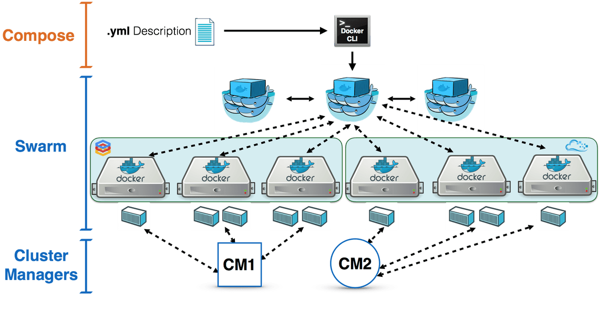

# Docker Swarm

O Docker Swarm é uma ferramenta nativa do Docker para criação de cluster de servidores Docker, ou seja, o Swarm fica responsável por iniciar os containers dentro de um ou algum hosts fisicos permitindo ter uma alta disponibilidade do seus serviços.

Nesse lab iremos criar uma infra com dois servidores, sendo:

* 1x Master
* 1x Worker

Um exemplo de arquitetura e funcionamento seria assim:

<p align="center">
    
</p>

Temos o arquivo docker-compose com todos os serviços e configurações necessárias, onde o Swarm recebe as informações através da docker-cli e executa os containers dividindo a carga entre os hosts do cluster.

## Preparando a Infraestrutura

Obs: Para executar alguns a maioria dos passos é necessário que a sua máquina de onde está executando os comandos tenha as permissões corretas para criar recursos na AWS.

Para esse lab iremos precisar criar algumas coisas na AWS, o primeiro que iremos criar será o Security Group (saiba mais clicando [aqui](https://docs.aws.amazon.com/pt_br/AmazonVPC/latest/UserGuide/VPC_SecurityGroups.html)), explicando bem resumidamente o Security Group é como se fosse um firewall que permite ou não a saída e entrada de pacotes.

Antes de criar o Security Group precisamos saber qual é a nosso VPC Id (nesse lab iremos utilizar o VPC default e não criaremos um novo, e caso queira saber o que é um VPC [clique aqui](https://docs.aws.amazon.com/AmazonVPC/latest/UserGuide/VPC_Subnets.html)):

```bash
aws ec2 describe-vpcs --query 'Vpcs[].VpcId[]'
```

A saída será algo parecido com o json abaixo:

```json
[
    "vpc-abcd1234"
]
```

Obs: Caso tenha mais de um escolha o que melhor te atenda e não cause nenhum impacto.

Sabendo o VPC Id execute o comando lembrando de trocar para o seu VPC Id:

```bash
aws ec2 create-security-group --group-name swarm-sg --description "Swarm security group" --vpc-id <VPC Id>
```

O comando irá retornar o Group Id, para adicionarmos rehgras de segurança:

{
    "GroupId": "sg-abcd1234"
}

Para esse Security Group iremos adicionar a seguintes regras:

* Porta 80 - HTTP

```bash
aws ec2 authorize-security-group-ingress --group-id <Group Id> --protocol tcp --port 80 --cidr 0.0.0.0/0
```

* Porta 5000-5001 - HTTP

```bash
aws ec2 authorize-security-group-ingress --group-id <Group Id> --protocol tcp --port 5000-5001 --cidr 0.0.0.0/0
```

* Porta 22 - SSH

```bash
aws ec2 authorize-security-group-ingress --group-id <Group Id> --protocol tcp --port 22 --cidr <Seu IP Publico ou IP de seu servidor de testes>
```

* Tudo (para todos os recursos que utilizarem o mesmo Security Group)

```bash
aws ec2 authorize-security-group-ingress --group-id <Group Id> --protocol all --source-group <Group Id>
```

Para criar nosso hosts precisamos saber também em qual Subnet iremos criar os nossos servidores (caso queira saber mais de subenets [clique aqui](https://docs.aws.amazon.com/AmazonVPC/latest/UserGuide/VPC_Subnets.html)), para isso execute o comando:

```bash
aws ec2 describe-subnets --query 'Subnets[].[AvailabilityZone,SubnetId]'
```

A saída será algo parecido com:

```json
[
    [
        "us-east-1a", 
        "subnet-abcd1234"
    ], 
    [
        "us-east-1b", 
        "subnet-abcd1235"
    ]
]
```

Escolha uma Availability Zone de sua preferência e sua respectiva Subnet para o comando a seguir:

Obs: A região é a parte "us-east-1" e a Avalailability Zone "b" por exemplo.

```bash
docker-machine create -d amazonec2 --amazonec2-vpc-id <VPC Id> --amazonec2-subnet-id <Subnet Id> --amazonec2-region <Região> --amazonec2-zone <Availability Zone> --amazonec2-instance-type t2.micro --amazonec2-security-group swarm-sg master01
```

Esse comando cria nossa primeira instância denominada `master01` com todos os dados que coletamos nos passos anteriores, como VPC Id, Subnet Id, Região e Zona.

Para listar as máquinas que temos criadas dentro da docker-machine

```bash
docker-machine ls
```

Agora iremos acessa a máquina master, porém para termos um controle melhor sobre ela precisamos pegar algumas informações do servidor e colocar como váriaveis de ambiente do nosso host:

```bash
eval $(docker-machine env master01)
```

E para acessar via ssh, execute:

```bash
docker-machine ssh master01
```

## Iniciando o Swarm

Para iniciar o cluster precisamos executar o comando:

```bash
docker swarm init --advertise-addr eth0
```

Após rodar o comando, a saída será um comando já pronto para ingressar novos hosts dentro do cluster. Será algo como:

```bash
Swarm initialized: current node (pq4mybxbhoasf9uvti2acknwi) is now a manager.

To add a worker to this swarm, run the following command:

    docker swarm join --token SWMTKN-1-61apjhm9svrgkzlj7x136be9wlgnp6ozij0h0yur52k798sohd-4c3dmeg9b3y4hkab9rmjsegad <IP>:<Porta>

To add a manager to this swarm, run 'docker swarm join-token manager' and follow the instructions.
```

Com o comando em mãos vamos antes crair o nosso host que será o worker:

```bash
docker-machine create -d amazonec2 --amazonec2-vpc-id <VPC Id> --amazonec2-subnet-id <Subnet Id> --amazonec2-region <Região> --amazonec2-zone <Availability Zone> --amazonec2-instance-type t2.micro --amazonec2-security-group swarm-sg worker01
```

Agora vamos acessar o nosso worker e executar o comando para ingressa-lo no cluster:

```bash
docker-machine ssh worker01

sudo docker swarm join --token SWMTKN-1-61apjhm9svrgkzlj7x136be9wlgnp6ozij0h0yur52k798sohd-4c3dmeg9b3y4hkab9rmjsegad <IP>:<Porta>
```

Tem que aparecer uma mensagem como essa:

```bash
This node joined a swarm as a worker.
```

E agora vamos listar os nossos servidores do cluster:

```bash
docker node ls
```

## Deploy

Agora que temos toda a infra necessária e o cluster pronto vamos executar o deploy da nossa aplicação, para esse lab iremos utilizar uma compose que subirá diversos serviços e uma aplicação de votação, execute:

```bash
curl https://raw.githubusercontent.com/dockersamples/example-voting-app/master/docker-stack.yml -o docker-stack.yml

docker stack deploy -c docker-stack.yml vote
```

A arquitetura dessa aplicação funciona da seguinte forma:

<p align="center">
    
</p>

Após realizar o deploy para visualizarmos os serviços, digite:

```bash
docker service ls
```

Para descobrir os ips dos servidores, execute o seguinte comando:

```bash
docker-machine ip master01
docker-machine ip worker01
```

* Para votar acesse `http://<IP do Servidor Worker ou Master>:5000`
* Para visualizar os votos acesse `http://<IP do Servidor Worker ou Master>:5001`

## Limpando a bagunça

Para remover a nossa stack, execute o comando:

```bash
docker stack rm vote
```

E para remover as máquina:

```bash
docker-machine rm master01 -y
docker-machine rm worker01 -y
```

E por ultimo o Security Group:

```bash
aws ec2 delete-security-group --group-name swarm-sg
```

Caso se interessou sobre o assunto e gostaria de saber mais sobre Docker Swarm, acesse [aqui](https://docs.docker.com/get-started/part4/#introduction).
