# Preparando o Servidor

## Passo a Passo

Acesse sua conta AWS e após na barra de pesquisa digite EC2 e clique na primeira opção:

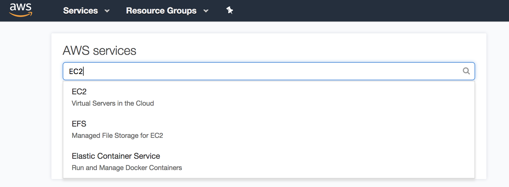

Clique em "Launch Instance"

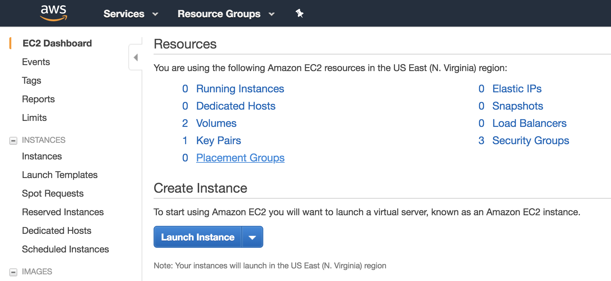

Selecione a imagem "Amazon Linux 2 LTS Candidate 2 AMI"

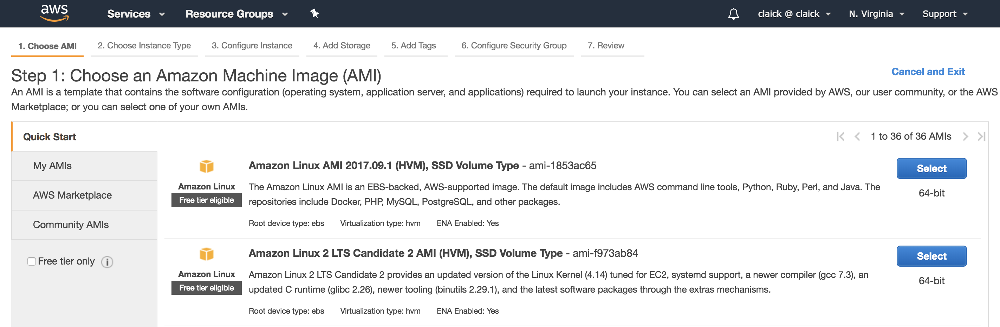

Escolha o tipo "t2.micro" e clique em "Next: Configure Instance Details"

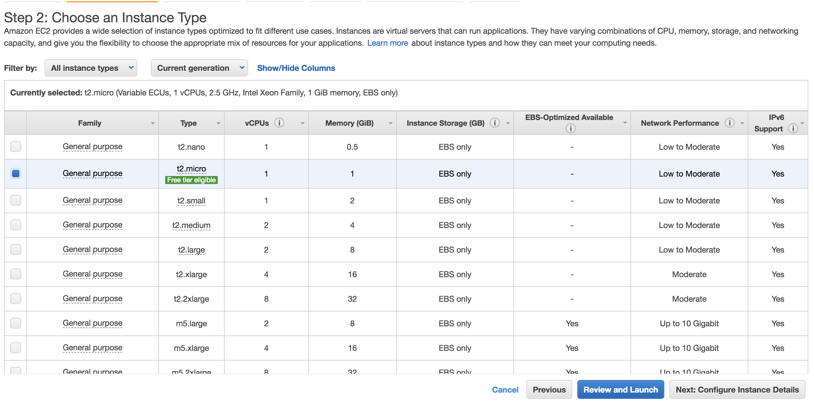

Habilite o "Auto-assign Public IP" e clique em "Next: Add Storage"

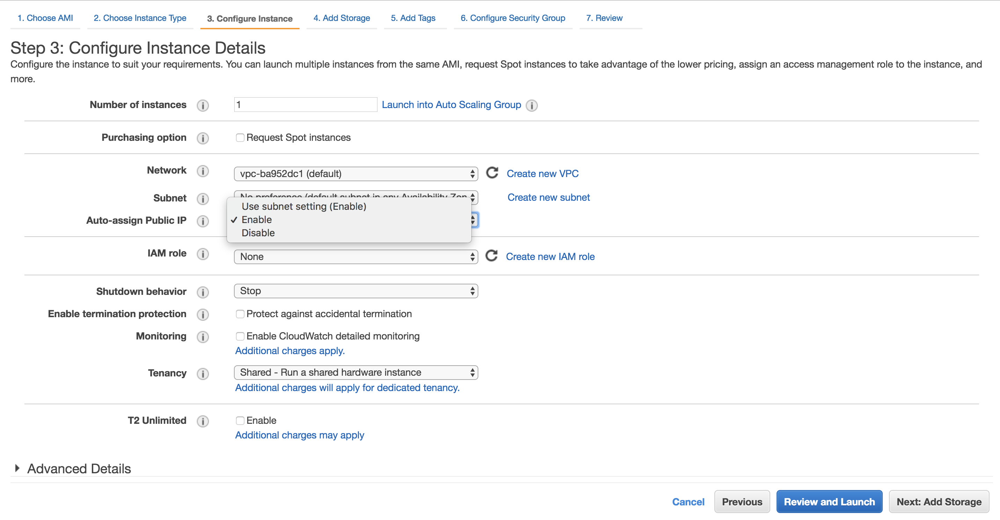

Altere o tamanho do disco de 8 GiB para 15 GiB e clique em "Next: Add Tags"

Clique em Add Tag e adicione uma Tag chamada "Name" e com o "Valor" docker-lab e clique em "Next: Configure Security Groups" 

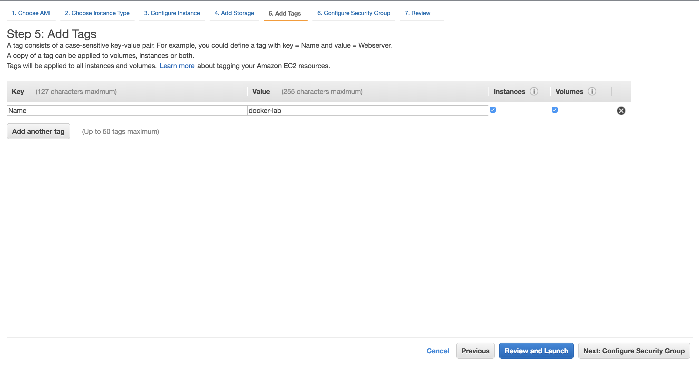

Crie um novo Security Group chamado docker-lab para que assim possamos liberar a porta e SSH apenas para o seu IP de acesso, para isso selecione em "Source" a opção "MyIP" e clique em "Review and Launch"

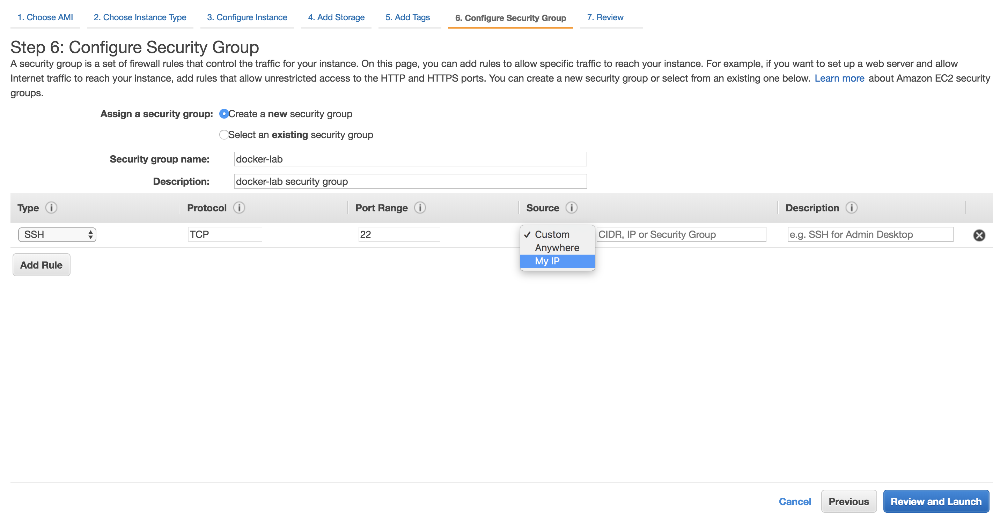

Valide se todas as configurações estão corretas e clique em "Launch"

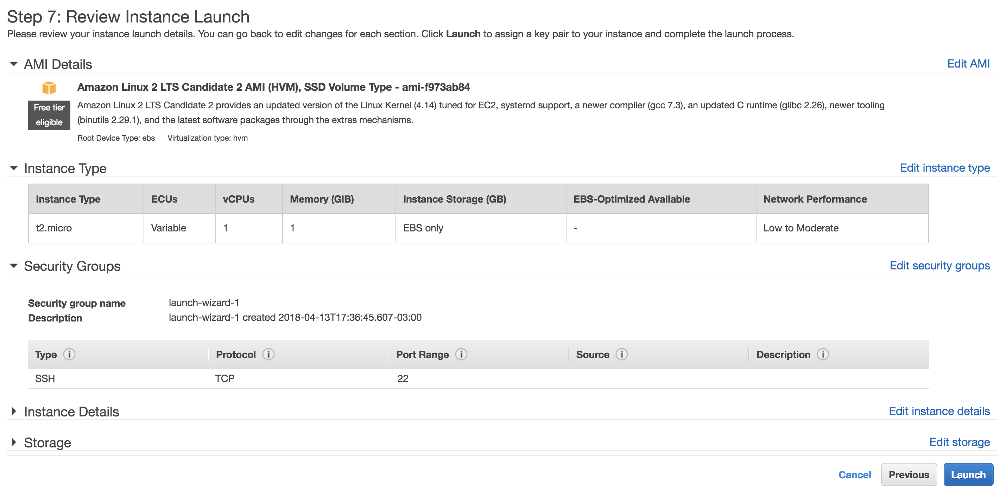

Para acessar o servidor via SSH é preciso criar uma chave de SSH (caso você não tenha uma criada ainda), para criar selecione "Create a new key pair" e de um nome a essa chave exemplo "docker-lab" e clique em "Download Key Pair". Clique em "Launch Instance"

    Obs: Guarde bem essa chave, pois caso perca não será possível recupera-la e você não terá acesso ao servidor.

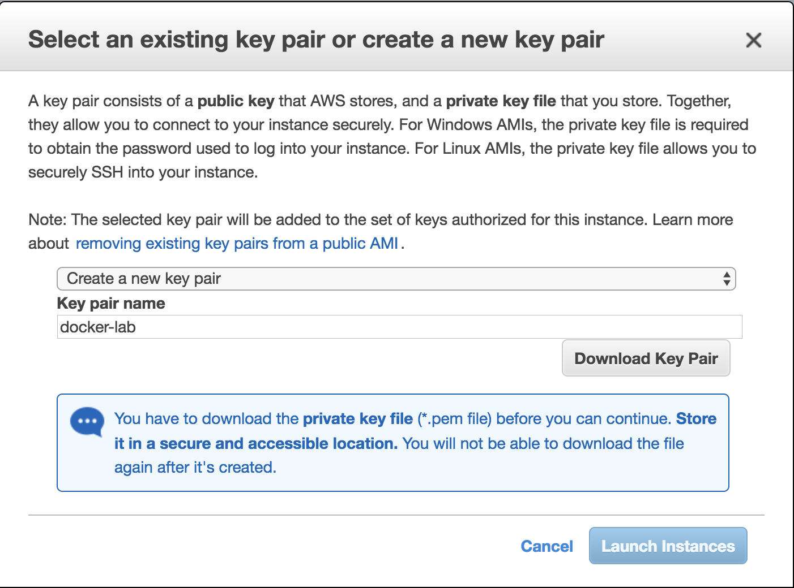

Clique em "View Instance"

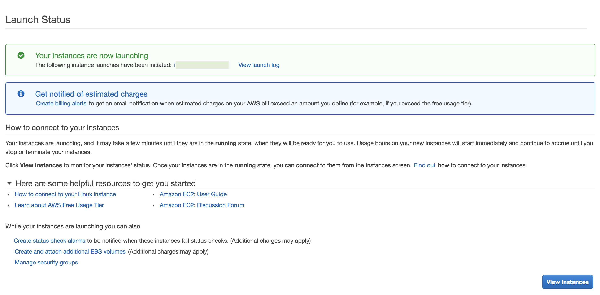

Agora que a máquina está ligada, só copiar o IP Público para acessa-la via SSH.

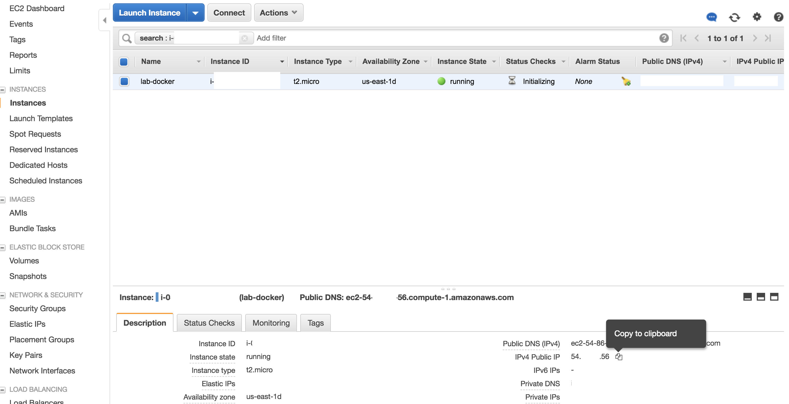