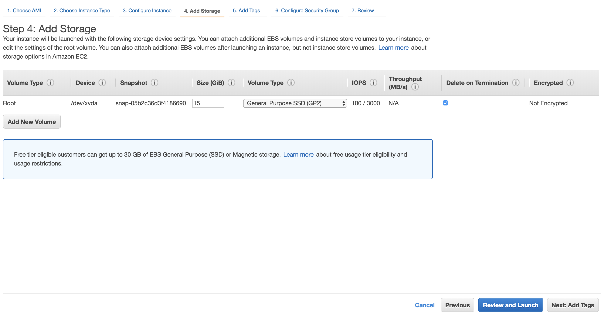

# Preparando o Servidor

## Overview

Este guia contém labaratórios e exercícios para mostrar um pouco sobre o Docker e outras ferramentas que fazem parte desse universo como: Como realizar a instalação, comandos, docker-compose, Swarm, ECS e Kubernetes.

#### Passo a Passo

Acesse sua conta AWS e após na barra de pesquisa digite EC2 e clique na primeira opção:

Clique em "Launch Instance"

Selecione a imagem "Amazon Linux 2 LTS Candidate 2 AMI"

Escolha o tipo "t2.micro" e clique em "Next: Configure Instance Details"

Habilite o "Auto-assign Public IP" e clique em "Next: Add Storage"

Altere o tamanho do disco de 8 GiB para 15 GiB e clique em "Next: Add Tags"

Clique em Add Tag e adicione uma Tag chamada "Name" e com o "Valor" docker-lab e clique em "Next: Configure Security Groups" 

